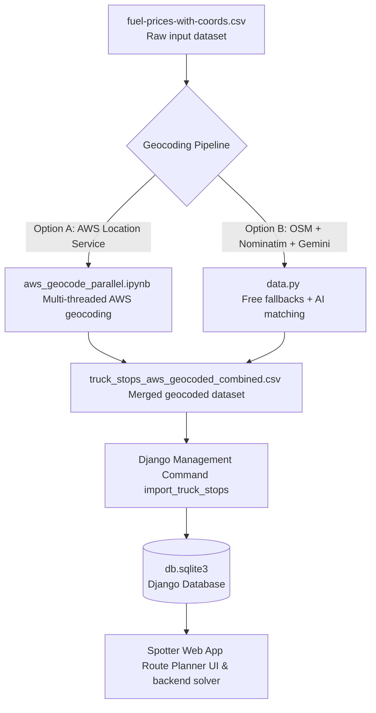

# 📍 Spotter — Fuel Stop Routing Planner

Spotter is a Django-based web application designed to optimize long-haul trucking routes by identifying the most cost-effective fuel stops. By analyzing truck stops, retail prices, and geographic coordinates, Spotter calculates routes and suggests optimal refuelling locations within a specified driving range.

This repository contains:

1. **The Django Web App (`spotter`)**: Route planning engine, map visualization, auto-complete APIs, and database models.
2. **The Geocoding Pipeline (`data.py` & `aws_geocode_parallel.ipynb`)**: Scripts to clean and match raw truck stop details with high-accuracy lat/lon coordinates.

---

## 🗺️ System Architecture & Data Flow



---

## 🚀 Getting Started

Follow these steps to set up the environment, run migrations, populate the database, and launch the web server.

### 1. Environment & Setup

Activate the virtual environment and install the required Python packages:

```bash
# 1. Create a virtual environment (if not already done)
python3 -m venv .venv

# 2. Activate the virtual environment
source .venv/bin/activate

# 3. Install packages
pip install -r requirements.txt
```

### 2. Configure Environment Variables (`.env`)

A `.env` file is required in the root directory to store configuration secrets and API keys.

1. Copy the example environment template:
   ```bash
   cp .env.example .env
   ```
2. Open `.env` and fill in the values:
   - **`DJANGO_SECRET_KEY`**: A secure random string for Django security.
   - **`GOOGLE_API_KEY` / `GOOGLE_MAPS_API_KEY`**: Required for Google Maps/Gemini AI fallbacks.
   - **`AWS_API_KEY` / `AWS_DEFAULT_REGION`**: Required if you plan to run geocoding via AWS Location Services.

> [!NOTE]
> For local development, a default `.env` file has been pre-configured with a development secret key, allowing database commands to run immediately.

### 3. Run Database Migrations

Apply Django migrations to set up the SQLite database and create the required schema for `Place` models:

```bash
python spotter/manage.py migrate
```

### 4. Populate Database (Ingest Geocoded Data)

We have a pre-geocoded and cleaned dataset ready for ingestion. Run the custom Django management command to load it into the database:

```bash
python spotter/manage.py import_truck_stops " output/data.csv" --clear
```

> [!TIP]
> The `--clear` flag deletes any pre-existing rows in the `Place` table before importing. This ensures you start with a clean and deduplicated dataset.

### 5. Launch the Web Application

Start the local development server:

```bash
python spotter/manage.py runserver
```

Open your browser and navigate to: **[http://127.0.0.1:8000/](http://127.0.0.1:8000/)**

---

## 🛠️ Geocoding Pipeline Details

If you ever need to re-run the geocoding pipeline on raw data (`fuel-prices-with-coords.csv`), you can choose from the following utilities:

### Geocoder Comparison

| Feature / Utility | `aws_geocode_parallel.ipynb`                  | `data.py`                                         |
| :---------------- | :-------------------------------------------- | :------------------------------------------------ |
| **Provider**      | AWS Location Service (Places v2 API)          | OpenStreetMap (Overpass & Nominatim) + Gemini AI  |
| **Execution**     | Jupyter Notebook (Parallel Threads)           | CLI script (Sequential + Rate limits)             |
| **Cost**          | Paid (AWS billing rates)                      | Free (OSM rates) + Gemini API cost (optional)     |
| **Key Advantage** | High speed, very accurate highway coordinates | Cost-effective fallback, Gemini AI disambiguation |

### Running the Free/AI Geocoder (`data.py`)

Run the CLI geocoder with the default configuration:

```bash
# Geocode the first 50 rows using OSM/Nominatim only
python data.py --rows 50 --input fuel-prices-with-coords.csv

# Geocode using Gemini AI for ambiguous/abbreviated matches
python data.py --rows 50 --use-ai
```

### Running the Parallel Geocoder (`aws_geocode_parallel.ipynb`)

1. Start your Jupyter environment.
2. Open `aws_geocode_parallel.ipynb`.
3. Set your AWS credentials/API keys in the environment.
4. Run all cells. It will split the work across 20 parallel worker threads, write intermediate files to `results/`, and merge them into `truck_stops_aws_geocoded_combined.csv`.

---

## ⚡ API Endpoint & Postman / cURL Examples

Spotter supports a JSON API view by adding `format=json` as a query parameter or specifying `Accept: application/json` in your request headers.

### Query Parameters

| Parameter     | Type   | Required | Description                                                                                                          |
| :------------ | :----- | :------- | :------------------------------------------------------------------------------------------------------------------- |
| `input_mode`  | String | Yes      | `location` to search by city/state names, or `coords` for raw lat/lon values.                                        |
| `provider`    | String | No       | Routing provider to use: `free` (OpenStreetMap / OSRM) or `aws` (AWS Geo-Places / Route calculator). Default: `aws`. |
| `price_field` | String | No       | Fuel price column to optimize: `average` (Average Retail Price) or `max` (Highest Price). Default: `average`.        |
| `range_miles` | Float  | No       | Maximum driving range of the truck in miles before refuelling. Default: `500.0`.                                     |
| `mpg`         | Float  | No       | Fuel efficiency in Miles Per Gallon (MPG). Default: `10.0`.                                                          |
| `radius_km`   | Float  | No       | Search radius in kilometers around the route to look for truck stops. Default: `5.0`.                                |
| `format`      | String | No       | Set to `json` to get raw JSON instead of rendering the HTML template.                                                |

---

### Example A: Location-Based Route Planning (New York ➔ Chicago)

Resolve locations dynamically using the default geocoder:

**cURL Request:**

```bash
curl -s "http://127.0.0.1:8000/?input_mode=location&start_location=New+York%2C+NY&end_location=Chicago%2C+IL&provider=free&format=json"
```

---

### Example B: Coordinate-Based Route Planning (New York ➔ Chicago)

Provide precise geographic coordinates directly:

**cURL Request:**

```bash
curl -s "http://127.0.0.1:8000/?input_mode=coords&start_lon=-74.0060&start_lat=40.7128&end_lon=-87.6298&end_lat=41.8781&provider=free&format=json"
```
